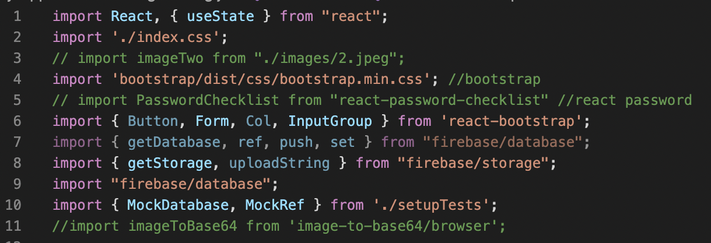

# Project Overview - DiscoveryHub

The project we are examining is DiscoveryHub, which is a web application for matching guardians with organizations. The purpose of this application is to have a hub for free tutors and mentors that guardians can easily find for their children. This was originally developed by Victoria Nguyen, Precious Stowers, Sneha Reddy and Nat Sakulborrirug in INFO 442. The project was made using the React framework.

For this project we analyzed the [registerOrg.js](https://github.com/info443-wi22/project-1-victoriathegr8/blob/main/my-app/src/registerOrg.js) file. This file had a module called `Createform`, which was used for users registering their organizations to the DiscoveryHub database. This file had a sufficient amount of code to work with and had lots of input to test. Additionally, there were good examples of code smells and other architectural problems we could refactor. These are all reasons why the `registerOrg.js` file was a good choice for architectural analysis.

# Code Structure Analysis

## Architectural Elements


*Figure 1: component diagram of DiscoveryHub*

The codebase is a web app structured using the React framework. For our abstraction level, we examined individual files of the application. Figure 1 shows the files of the React web application. The following are the different elements of the structure:

1. `About` - `About` is composed of two different functions/components. The first function (`About`) renders the jsx of the` Content` function. The `Content` function renders all of the content of the website’s about page, including the website description and team.
2. `popUp` - `popUp` is composed of one state variable and four functions/components. The state variable, `closedModal`, describes the display of the initial signup modal. The first function, `PopUp()` encompasses the next three functions as a component and renders the jsx of the signup modal. The first function included within the `PopUp` component is `closeAddModal`, which closes the initial signup modal. The second function within the `PopUp` component is `showAddModal`, which shows the Register your Organization modal and hides both the signin and signup modal. The third function with the `PopUp` component is `showAddModalReg`, which shows the signin modal and hides the initial signup modal.
3. `orgProfile` - `orgProfile` contains one function/component - `OrgProfilePages`. The component uses the parameters of the URL to filter for the specifically chosen organization details. It then renders a tailored profile page for that organization with the following details/attributes:
- `picture`
- `name`
- `city`
- `institution`
- `bio`
- `platform`
- `service`
- `email`
- `url`
4. `homepage` - `homepage` contains one main function/component - `CreateCardsList`. It contains two state variables: `loading`, which describes if the page is done loading, and `favIdArr`, which contains the ids of the user’s favorited organizations. `CreateCardsList` first fetches organizations from the Firebase database, then renders each organization in the form of a card. The function `handleFavButton` is called upon hitting the favorite button on a card. This action adds that organization to the user’s favorites in the database. The `favBtnStatus` function determines the style of the favorite button on each organization card, depending on if the user has already favorited the organization.
5. `filters` - `filters` contains one component called `Filtering`. This component is used for filtering organizations by different filters, such as cities and services. This component has a helper function defined as `HandleFilterInput` which renders the filters that users choose to filter from. The `filters` component has three props, which are `data`, `setCurrentData` and `dataCopy`. `data` is an array of objects that represent the list of organizations in DiscoveryHub. `setCurrentData` is a state setter function that sets the list of organizations to the specified filters that users use. `dataCopy` is the original data to be used for rerendering the organizations.
6. `registerOrg` - `registerOrg` contains inputs used to populate another organization in DiscoveryHub. The `Createform` function is the main component that is used in the application. The `Push` function is a helper anonymous function that validates inputs being used for an organization; if a form is filled out incorrectly, the push function would not activate. There are several `handle` functions that are used as helper functions for specific organization details, such as services and subjects. The component uses several state variables to populate details of an organization. These are listed as below:
- `name`
- `email`
- `city`
- `institution`
- `bio`
- `services`
- `subjects`
- `platforms`
- `website`
- `base64URL`
- `validation`
7. `favorites` - `favorites` contains one main component - `favoritesContent`. The component contains two state variables - `loading`, which describes if the page is done loading, and `favOrgs`, which contains the user’s favorited organizations, which is fetched from the Firebase database. The component renders the user’s favorited organizations in card format.
8. `userProfile` - `userProfile` has one component called `ProfilePage`. This component is used by the user to change some attributes of their profile. This component takes in props from the current user, such as `displayName`, `image`, `password`, `email` and `id`. `displayName` is the username of the user, which is stored as a string. `image` uses a base64 URL as a string, which is decoded into an actual image. `email` is the email of the user, which is a string. `password` is the password of the user, which can be changed and is a string. `id` is an integer, which is the user’s id in the database; this cannot be seen by the user. There are several helper functions such as `handleNameEdit` and `handleEmailEdit` which assist with editing the user’s information.
9. `userReg` - `userReg` first configures the Firebase database. It contains one main component, `UserReg`, which contains the following state variables: `image`, `password`, `name`, `email`, `id`, `picture`, and `base64URL`. Within the `UserReg` component, there are multiple functions. First is `handleFileInputChange`, which converts an uploaded image to a base64 URL. Next is `handleName`, which sets the `name` state variable to the inputted name. Next is `handleEmail`, which sets the `email` state variable to the inputted email if it is validated. Next is `handleAgeCheck`, which checks if a user states they are above 18. Next is `handleValidPassword`, which sets the `password` state variable to the inputted password. Next is `handleSubmit`, which checks to make sure all input fields are validated before allowing submission. The component renders a modal for users to signup/signin with, which is accompanied by the function `closeAddModal`, which is used for closing the modal.

Because DiscoveryHub is a React web application, most of the components are connected to the App through an **aggregation relationship**. This means that the components belong to the App and the components can exist independently from the App. For example, if the App file was deleted, the components would still be there. This was represented in the UML diagram with a diamond. There are some components with an association relationship with other components. This includes the `homepage` component having an association with `filters` and `registerOrg`, and the `userProfile` component having an association with `userReg`. These components have association relationships because the components have information that changes the way another component works. For example, a user could specify different filters in `filters` which would change how the `homepage` component would look like.


## Process Flows


*Figure 2: sequence diagram of DiscoveryHub*

Figure 2 shows the **structural diagram** of the web application. The user starts off by visiting the webpage. This renders all the components of the application. The user can input organization information and submit it through the `Createform` component. The user can fill out new information for a new account through the `UserReg` component. The user can click on “See More” on different organizations through the `OrgProfilePages` component to see different views of the webpage. The user can filter by specific subjects, cities and statuses through the `Filters` component. The user can favorite organizations through the `CreateCardsList` component, which is rendered through `FavoritesContent`. All of these components rerender one at a time because of states being updated through the user interactions.

# Architecture Assessment

The module we are assessing the architecture of is `registerOrg.js`.

## Code Smells

There are a couple of code smells that are seen in `registerOrg.js`.

| Code Lines                | Code Smell/Architectural Deficiency                                                                                                                                                                                                                                                                              | How We Refactored This                                                                                                                                                                                                                                                                                 |
|---------------------------|------------------------------------------------------------------------------------------------------------------------------------------------------------------------------------------------------------------------------------------------------------------------------------------------------------------|--------------------------------------------------------------------------------------------------------------------------------------------------------------------------------------------------------------------------------------------------------------------------------------------------------|
|                     | Long function - The `Push` function is around 100 lines long. It is used to test the validity of every input field in the form all at once. This is redundant if one of the earlier validation tests fails and it continues to test the rest. It also introduces a significant computation once it is triggered. | Refactored with the following steps: <ul><li>Refactored into one helper function that sets innerHTML for each element</li><li>Refactored into multiple helper functions based on different conditionals of state variables</li><li>Removed some console.log statements</li><li>Refactored `validation` into an object for clear naming</li></ul> |
|                        | Speculative Generality - The `addOrg` function was a stub function created to represent a function that adds an organization to the database. This functionality ended up being included in the `Createform` component as the `Push` function.                                                                   | The code block was deleted                                                                                                                                                                                                                                                                             |
|                  | Redundant Comments - as an example, line 174 states that line 175 makes a new filereader, which can be seen in the code itself                                                                                                                                                                                   | Redundant comments were deleted or recommended                                                                                                                                                                                                                                                         |
|     | Code in Comments - comments in code clutter the architecture. Comments in code should either be deleted or included within the code                                                                                                                                                                              | Code in comments were deleted                                                                                                                                                                                                                                                                          |
|  | Shotgun Surgery - these handle functions have the same structure and uses, only with different variable names. This could be condensed into a single helper function that takes in parameters for different variables                                                                                            | Refactored into one single helper function that can be used for all inputs                                                                                                                                                                                                                             |

*Table 1: List of Code Smells*

## Documentation and Readability


*Figure 3: Code Snippet of a Redundant Comment Code Smell*

Some variables could have been named a bit better for **more readability**. For example, the `name` state variable is a little ambiguous without knowing the context of the JSX. A `name` could be a user name or an organization name. There are other variable names that are well documented, such as `getBase64`, which gets the base64 string of something. This variable name is self-documenting and does not need a comment for explanation. Some comments are very helpful while others are not particularly useful. This can be seen with lines 174 - 178. While lines 174 seems very redundant, which simply restates the code on line 175, line 177 is helpful to understand the code because line 178 uses a function called `readAsDataURL`. The comment on line 177 is more specific and gives an outside reader the knowledge of what the function does. Overall, `registerOrg.js` has some documentation and readability issues but are easy to understand for the most part.

## Standards Violations

This codebase was designed to comply with any specific standards.

## Design Quality Deficiencies

There are two design quality deficiencies within the code. These two are **security** and **modifiability**.


*Figure 4: Code Snippet of Firebase operation*

The form rendered by the code asks for an organization’s email address and then pushes it to Firebase upon submission (lines 129-143). This poses a threat to security, as all of the emails are stored in the same location and are unencrypted. If someone with malicious intent was able to access the database (which could be possible, as it currently has read and write permissions open to anyone), they could mass-spam all of the emails at once. This could be solved by encrypting the emails before pushing them to the Firebase.


*Figure 5: Code Snippet of `getBase64`*

There is a specific instance of modifiability as a deficiency within lines 174 - 205. The helper function `handleFileInputChange` requires a function called `getBase64` to operate. The latter function returns a promise for the former function to handle. This is an example of **semantic coupling** because if the `getBase64` function did not exist, then `handleFileInputChange` cannot do asynchronous work. Likewise, if the `handleFileInputChange` function did not exist, then `getBase64` would serve no purpose in the code. To solve this deficiency, the promise work could be done within the `handleFileInputChange` function so the code would be easier to read and would technically be a part of the function itself.

# Unit Tests

## Running Tests

1. From the command line, change the directory to my-app
2. Run ```npm i``` to install jest dependencies
3. Run ```npm run test``` to start testing

## Testing Methods

For our testing method, we used **structured basis** testing for our unit testing. Many lines of code within our `registerOrg.js` file were if statements. Some state variables even had multiple conditionals, such as testing for a valid URL. A valid URL must not be undefined, must not have a length of 0 and must include a period. Therefore, there were many test cases we had to deal with for multiple conditionals. Our test file was located under `project-1-victoriathegr8/my-app/src/tests/registerOrg.test.js`.


*Figure 6: `defaultValue` tag example*

We had to add in some testing code to make our tests work using Jest. We added IDs to checkboxes for testing purposes because we had to select elements by their ID within our testing file. We had to remove some console.log statements for a faster runtime. We replaced some `selected` tags with a `defaultValue` tag for easier selection of elements. We added a test ID to the `selectCity` tag to easily select that element as well.

| Assertion                                                            | Justification                                                                                                                                                                                                                                                                                                            |
|----------------------------------------------------------------------|--------------------------------------------------------------------------------------------------------------------------------------------------------------------------------------------------------------------------------------------------------------------------------------------------------------------------|
| The form shows the form title                                        | The form title was the only text element in the form, and explains the purpose of the form to the user.                                                                                                                                                                                                                  |
| The form shows no error if a name is entered                         | This test mocks a user entering an organization name (“WINFO”) in the name input field and attempting to submit. This should complete the validation (not being null) necessary for the name attribute of an organization, allowing for it to be submitted to the database.                                              |
| The form shows no error if bio is typed in                           | This test mocks a user entering an organization email (“hello@email.com”) in the email input field and attempting to submit. This should complete the validation (not being null and including a “@”) necessary for the email attribute of an organization, allowing for it to be submitted to the database.             |
| The form shows no error if bio is typed in                           | This test mocks a user entering an organization bio (“bio”) in the email input field and attempting to submit. This should complete the validation (not being null) necessary for the bio attribute of an organization, allowing for it to be submitted to the database.                                                 |
| The form shows no error if at least one service is checked           | This test mocks a user inputting that their organization offers mentoring services. This should  complete the validation (checking at least one service) necessary for the services attribute of an organization, allowing for it to be submitted to the database.                                                       |
| The form shows no error if at least one subject is checked           | This test mocks a user inputting that their organization offers mentoring/tutoring in writing and attempting to submit. This should  complete the validation (teaching about at least one subject) necessary for the subjects attribute of an organization, allowing for it to be submitted to the database.             |
| The form shows no error if at least one platform is checked          | This test mocks a user inputting that their organization offers their services in person and attempting to submit. This should  complete the validation (having their services through at least one platform) necessary for the platforms attribute of an organization, allowing for it to be submitted to the database. |
| The form shows no error if valid website is entered                  | This test mocks a user entering an organization website (“hello.com”) in the email input field and attempting to submit. This should complete the validation (not being null and including a “.”) necessary for the email attribute of an organization, allowing for it to be submitted to the database.                 |
| The form shows error if no picture is inputted                       | This test mocks a user submitting the form with no profile picture. This should not complete the validation (not being null) necessary for the profile picture attribute of an organization, which should prevent it from being submitted to the database.                                                               |
| The form shows error if profile picture uploaded is larger than 1 MB | This test mocks a user submitting the form with a profile picture larger than 1 MB. This should not complete the validation (not being larger than 1 MB) necessary for the profile picture attribute of an organization, which should prevent it from being submitted to the database.                                   |
| The form shows no error if profile picture uploaded is valid         | This test mocks a user submitting the form with a profile picture smaller than 1 MB. This should complete the validation (not being null or larger than 1 MB) necessary for the profile picture attribute of an organization, which should allow it to be submitted to the database.                                     |
| The form shows error if no city is selected                          | This test mocks a user submitting the form without selecting a city that the organization is in. This should not complete the validation (not being null) necessary for the city attribute of an organization, which should prevent it from being submitted to the database.                                             |
| The form shows no error if a city is selected                        | This test mocks a user inputting that their organization is in Seattle and submitting the form. This should complete the validation (not being null) necessary for the city attribute of an organization, which should allow it to be submitted to the database.                                                         |
| The modal should close upon clicking the X button                    | The user should be able to exit the register form to navigate to the rest of the website. The X button should have the affordance of closing the modal.                                                                                                                                                                  |
| The modal should close upon clicking outside the modal               | The user should be able to exit the register form to navigate to the rest of the website. Clicking on the greyed out area outside the modal should have the affordance of closing the modal.                                                                                                                             |

*Table 2: Test Assertions and Justifications*


## Testing Issues


*Figure 7: coverage report*

We were unable to achieve 100% testing coverage. Here is justification for the untested lines presented in our coverage report:

| Code Lines              | Justification                                                                                                                                                                                    |
|-------------------------|--------------------------------------------------------------------------------------------------------------------------------------------------------------------------------------------------|
| 182-186                 | This function is asynchronous, which makes it unreachable in our tests.                                                                                                                          |
| 202-203                 | These lines are run  upon a file being uploaded and read. Our test labeled “The form shows no error if profile picture uploaded is valid” passes, and therefore should have covered these lines. |
| 285, 303, 310-312, 319  | These lines are jsx lines that are rendered everytime `render(<Createform />)` is called, so they should be covered.                                                                             |

*Table 3: Justifications for Missed Tests*
